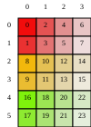
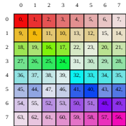
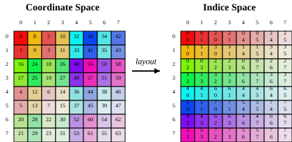

# cute-viz

A Python package for visualizing CuTe tensor layouts as SVG images.

## Installation

```bash
pip install -U git+https://github.com/NTT123/cute-viz.git
```

## Usage

```python
from cutlass import cute
from cute_viz import render_layout_svg, display_layout

@cute.jit
def main():
    # Create and render a layout to file
    layout = cute.make_layout((8, 8), stride=(8, 1))
    render_layout_svg(layout, "layout.svg")

    # Or display directly in Jupyter notebook
    display_layout(layout)

main()
```

## Examples

| Example | Output |
|---------|--------|
| [**Basic Layout**](examples/layout_example.py) |  |
| [**Swizzle Layout**](examples/swizzle_layout_example.py) |  |
| [**Thread-Value Layout**](examples/tv_layout_example.py) |  |
| [**LDMATRIX Copy Atom**](examples/ldmatrix_copy_example.py) |  |
| [**MMA Atom (16×8×8)**](examples/mma_atom_example.py) |  |

## Credits

Based on the original visualization code by [Cris Cecka](https://github.com/ccecka) from [NVIDIA/cutlass#2453](https://github.com/NVIDIA/cutlass/issues/2453#issuecomment-3133409976).

## License

MIT License - see LICENSE file for details.

